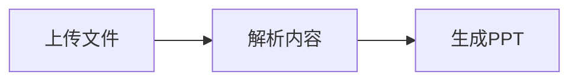

# PPT Generator

[](https://github.com/ygang6876-pixel/ppt-generator/actions/workflows/ci.yml)
[](LICENSE)

## Project Status

PPT Generator is an early-stage open source project for document-to-slide
automation. It provides a CLI, web UI, API endpoints, theme/layout templates,
Mermaid rendering, code highlighting, and Docker deployment files.

The repository includes contributor guidelines, a security policy, issue
templates, a roadmap, and CI tests to support long-term maintenance.

一个根据 Markdown、文本提纲、WPS/Word 文档自动生成可编辑 PowerPoint 的项目。

## 设计参考

本项目参考了几个成熟开源项目的优点：

- Presenton：网页上传文档、生成可编辑 PPT、支持模板和本地部署。
- Slidev：Markdown 优先、主题化、开发体验友好。
- Marp：顶部配置、主题体系、Markdown 到多格式导出。
- md2pptx：命令行简洁、支持模板/元数据、重视文档说明。

## 当前功能

- Markdown 转 `.pptx`
- WPS/Word `.docx` 转 `.pptx`
- 尝试自动转换 `.doc`、`.wps` 后生成 PPT
- 支持 Markdown 图片
- 支持 Markdown 表格转可编辑 PPT 表格
- 支持顶部配置 `title`、`subtitle`、`theme`、`footer`
- 支持页面布局指令：`text`、`image-right`、`image-left`、`full-table`
- 支持可视化模板：`cards`、`compare`、`timeline`、`metrics`、`summary`
- 支持 Mermaid 流程图、关系图渲染到 PPT
- 支持 Markdown 代码块高亮
- 提供 `/api/preview` 和 `/api/generate` 接口
- 提供 Dockerfile 便于部署
- 支持网页上传、粘贴内容、选择主题、自定义导出文件名
- 支持生成前预览 PPT 结构
- 支持多张图片上传，并自动生成图片展示型 PPT
- 支持命令行生成

## 快速开始

安装依赖：

```bash
pip install -r requirements.txt
npm install
```

命令行生成：

```bash
python main.py inputs/example.md outputs/example.pptx
```

指定主题和页脚：

```bash
python main.py inputs/example.md outputs/example.pptx --theme clean --footer "我的PPT生成项目"
```

启动网页：

```bash
python app.py
```

浏览器访问：

```text
http://127.0.0.1:5000
```

## 网页上传

支持：

- Markdown：`.md`、`.markdown`、`.txt`
- WPS/Word：`.docx`
- 尝试自动转换：`.doc`、`.wps`

说明：`.doc` 和 `.wps` 会先自动转换为 `.docx`，再生成 PPT。自动转换需要本机安装 LibreOffice，或安装 Microsoft Word 并具备 Windows 自动化能力。如果转换失败，请先在 WPS/Word 中另存为 `.docx` 后再上传。

## Markdown 写法

```markdown
---
title: 项目汇报
subtitle: 自动生成 PPT 示例
theme: clean
footer: PPT Generator
---

# 项目汇报

这是封面副标题。

## 项目目标

- 要点一
- 要点二

<!-- layout: image-right -->
## 图片页面

- 图片放在右侧
- 文字放在左侧


<!-- layout: full-table -->
## 表格页面

| 模块 | 状态 | 说明 |
| --- | --- | --- |
| 标题页 | 已完成 | 自动生成封面 |
| 表格页 | 已完成 | 转为可编辑表格 |
```

## 主题

可选主题：

- `business`：商务蓝色风格
- `clean`：白底简洁风格
- `dark`：深色演示风格
- `midnight`：深夜青蓝风格
- `emerald`：绿色清爽风格
- `sunrise`：暖色汇报风格
- `ivory`：纸感简洁风格
- `tech`：科技蓝紫风格

## 布局

可选布局：

- `text`：纯文字内容
- `image-right`：左文字、右图片
- `image-left`：左图片、右文字
- `image-full`：大图展示页
- `full-table`：大表格页面
- `cards`：三栏卡片页
- `compare`：左右对比页
- `timeline`：时间轴页
- `metrics`：指标数据页
- `summary`：总结清单页
- `diagram`：Mermaid 图表页
- `auto`：自动判断

## 可视化模板写法

三栏卡片：

```markdown
<!-- layout: cards -->
## 三栏卡片

- 文档上传
- 图片生成
- 主题美化
```

左右对比：

```markdown
<!-- layout: compare -->
## 对比页面

- 命令行生成
- 适合批量处理
- 网页生成
- 适合普通用户
```

时间轴：

```markdown
<!-- layout: timeline -->
## 项目路线

- 创建仓库
- 支持 Markdown
- 支持 WPS 文档
- 增加可视化模板
```

指标页：

```markdown
<!-- layout: metrics -->
## 项目指标

- 8: 内置主题
- 5: 可视化模板
- 6: 上传格式
- 2: 使用入口
```

总结页：

```markdown
<!-- layout: summary -->
## 总结页面

- 已支持多种输入来源
- 已支持主题和模板
- 已支持生成前预览
```

## Mermaid 图表

Markdown 中可以直接写 Mermaid 代码块：

````markdown
<!-- layout: diagram -->
## 生成流程图


````

说明：

- 程序会优先使用本机 `mmdc` 渲染。
- 执行 `npm install` 后，项目会安装本地 Mermaid CLI。
- 如果没有本地 `mmdc`，会尝试使用 Kroki 在线服务渲染。
- Mermaid CLI 需要本机有可用的 Chrome / Edge 浏览器环境。
- 如果图表无法渲染，请检查 Mermaid 语法，确认已执行 `npm install`，并确认浏览器可用。

## 代码块高亮

Markdown 代码块会自动转成带背景和语法高亮的 PPT 页面：

````markdown
<!-- layout: code -->
## 代码示例

```python
def hello(name: str) -> str:
    return f"Hello, {name}"
```
````

## API 与 Docker

API 使用说明见：

```text
docs/API.md
```

Docker 部署：

```bash
docker build -t ppt-generator .
docker run --rm -p 5000:5000 ppt-generator
```

Docker Compose：

```bash
cp .env.example .env
docker compose up -d --build
```

生产环境部署说明见：

```text
docs/DEPLOYMENT.md
```

## 图片生成 PPT

网页中可以直接多选上传图片：

- 只上传图片：每张图片自动生成一页 PPT
- 同时上传 Markdown 和图片：Markdown 中可以引用上传图片，例如 `` 或 ``
- 图片会自动按比例缩放，并套用当前选择的主题样式

## 生成前预览

网页中点击“预览结构”后，会先显示：

- PPT 总页数
- 封面标题
- 每页标题
- 每页布局
- 每页包含的文字、图片、表格数量

确认结构无误后，再点击“生成 PPT”导出文件。

## 项目结构

```text
ppt-generator/
|-- app.py
|-- main.py
|-- requirements.txt
|-- inputs/
|   |-- example.md
|   |-- docx_example.docx
|   `-- images/
|       `-- demo.png
|-- outputs/
`-- src/
    |-- document_converter.py
    |-- docx_parser.py
    |-- markdown_parser.py
    |-- ppt_builder.py
    `-- theme.py
```

## 后续计划

- 增加更多 Docker/生产环境配置
