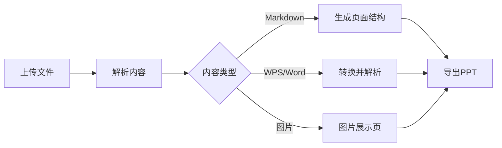
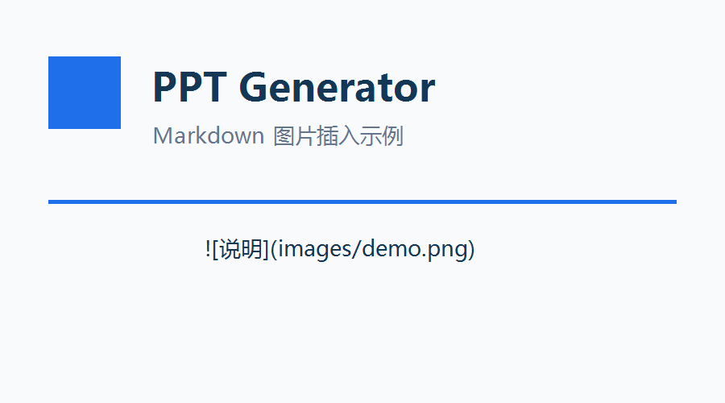

# PPT 生成项目演示

根据 Markdown 自动生成可编辑 PowerPoint。

<!-- layout: cards -->
## 三栏卡片

- 文档上传
- 图片生成
- 主题美化

<!-- layout: compare -->
## 对比页面

- 命令行生成，适合批量处理
- 支持脚本自动化
- 网页生成，适合普通用户
- 支持上传和预览

<!-- layout: timeline -->
## 项目路线

- 创建仓库
- 支持 Markdown
- 支持 WPS 文档
- 增加可视化模板

<!-- layout: diagram -->
## 生成流程图



<!-- layout: code -->
## 代码高亮

```python
from pathlib import Path

def generate_ppt(markdown_path: Path) -> str:
    deck = parse_markdown(markdown_path.read_text(encoding="utf-8"))
    output = markdown_path.with_suffix(".pptx")
    build_presentation(deck, output)
    return str(output)
```

<!-- layout: metrics -->
## 项目指标

- 8: 内置主题
- 5: 可视化模板
- 6: 上传格式
- 2: 使用入口

<!-- layout: image-right -->
## 图片页面

- 支持 Markdown 图片语法
- 图片会自动按比例缩放
- 可选择图片在左或在右



<!-- layout: full-table -->
## 功能进度表

| 模块 | 状态 | 说明 |
| --- | --- | --- |
| 标题页 | 已完成 | 自动生成封面 |
| 内容页 | 已完成 | 支持段落和列表 |
| 图片页 | 已完成 | 支持 Markdown 图片 |
| 表格页 | 已完成 | 支持 Markdown 表格 |
| 文档上传 | 已完成 | 支持 docx/doc/wps 尝试转换 |

<!-- layout: summary -->
## 总结页面

- 已支持多种输入来源
- 已支持主题和模板
- 已支持生成前预览
- 下一步可继续支持代码高亮和 Mermaid 图表
